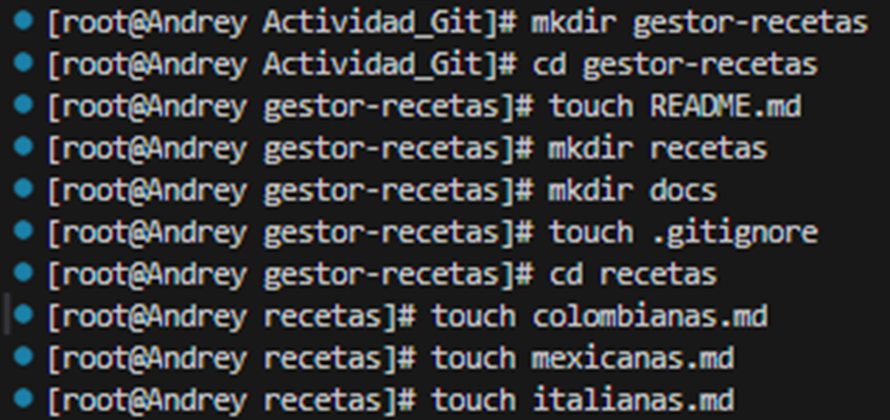
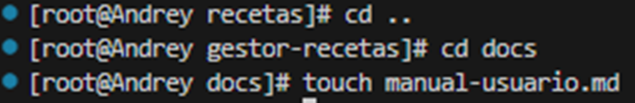
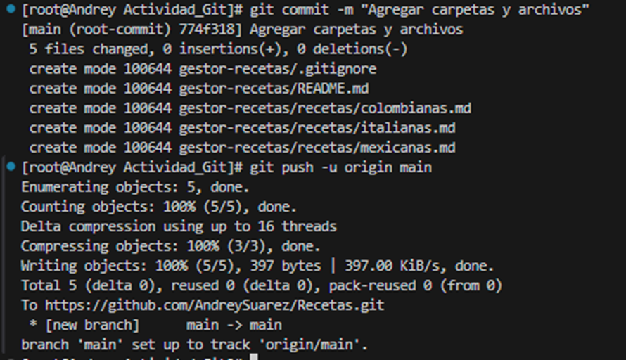
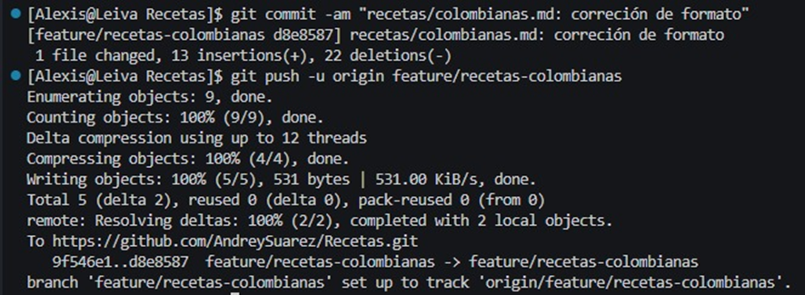
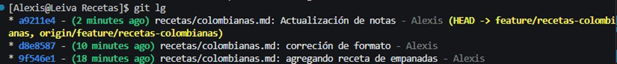
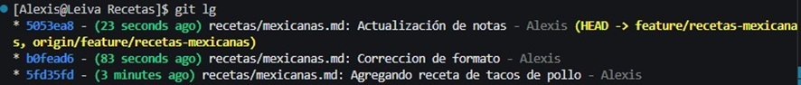
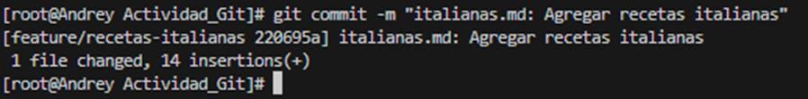
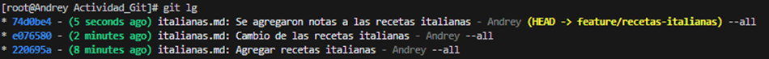

## Ramas creadas
Se crearon 4 ramas las cuales fueron:
* Rama main - Andrey
* Rama feature/recetas-colombianas - Alexis
* Rama feature/recetas-mexicanas - Alexis
* Rama feature/recetas-italianas - Andrey

## Explicación de los pantallazos
* 
  
  En estos pantallazos creamos todos las carpetas y archivos con los comandos mkdir para la creacion de las carpetas y touch para la creacion de los documentos

## Commit agregando todos las carpetas y archivos que pide el problema
* , Aqui realizamos el primer commit agregando los archivos en la rama main
* , Aqui se evidencia la creación de las 3 ramas que se deben crear

## Commits que se realizaron en la rama feature/recetas-colombianas
* , Aqui se evidencian el primer commit de la rama feature/recetas-colombianas
* , Aqui se evidencian todos los commits realizados a la rama feature/recetas-colombianas

## Commits que se realizaron en la rama feature/recetas-mexicanas
* , Aqui se evidencian todos los commits realizados en la rama feature/recetas-mexicanas

## Commits que se realizaron en la rama feature/recetas-italianas
* , Aqui se evidencian el primer commit de la rama feature/recetas-italianas
* , Aqui se evidencian todos los commits realizados a la rama feature/recetas-italianas 