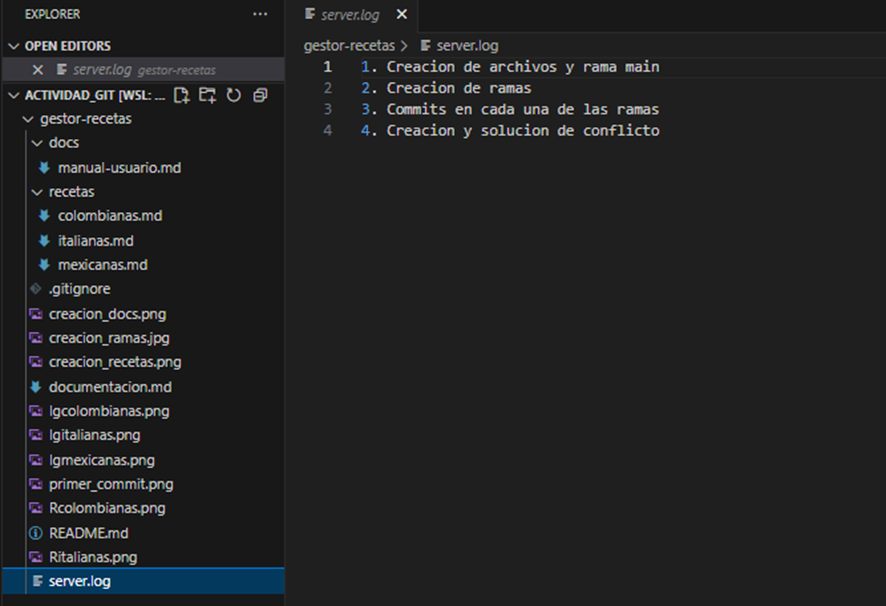
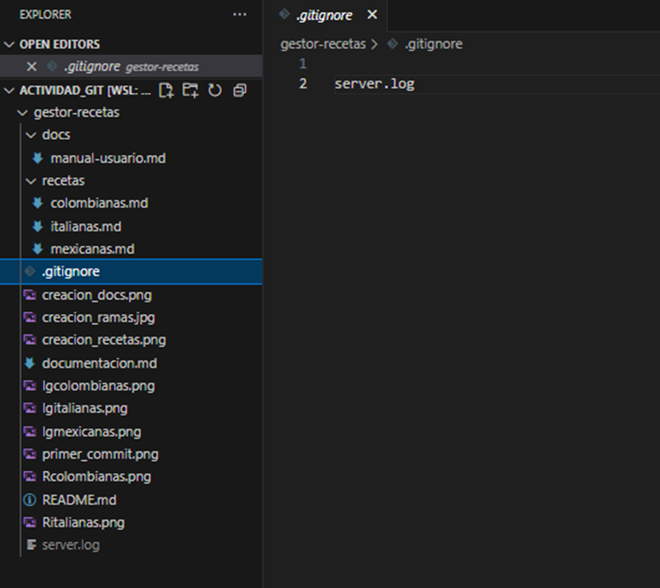

## Ramas creadas
Se crearon 4 ramas las cuales fueron:
* Rama main - Andrey
* Rama feature/recetas-colombianas - Alexis
* Rama feature/recetas-mexicanas - Alexis
* Rama feature/recetas-italianas - Andrey

## Explicación de los pantallazos
* 
  
  En estos pantallazos creamos todos las carpetas y archivos con los comandos mkdir para la creacion de las carpetas y touch para la creacion de los documentos

## Commit agregando todos las carpetas y archivos que pide el problema
* , Aqui realizamos el primer commit agregando los archivos en la rama main
* , Aqui se evidencia la creación de las 3 ramas que se deben crear

## Commits que se realizaron en la rama feature/recetas-colombianas
* , Aqui se evidencian el primer commit de la rama feature/recetas-colombianas
* , Aqui se evidencian todos los commits realizados a la rama feature/recetas-colombianas

## Commits que se realizaron en la rama feature/recetas-mexicanas
* , Aqui se evidencian todos los commits realizados en la rama feature/recetas-mexicanas

## Commits que se realizaron en la rama feature/recetas-italianas
* , Aqui se evidencian el primer commit de la rama feature/recetas-italianas
* , Aqui se evidencian todos los commits realizados a la rama feature/recetas-italianas

## Creacion de la rama conflicto y de un conflicto
, Aqui evidenciamos el commit del conflicto que queremos crear el cual es un texto en recetas italianas que al hacer un merge con la rama feature/recetas-italianas creara un conflicto
, Aqui realizamos el merge entre la rama conflicto y la rama feature/recetas-italianas
, Aqui se abre el editor para que solucionemos el conflicto y arregarlo como se evidencia aqui 

## Uso de .gitignore
, Aqui se realizo la creacion del server.log
, Aqui ya creamos el .gitignore en donde vamos a ingresar el server.log
, Aqui hacemos el commit y luego podemos evidenciar tanto en el proyecto en vscode como en el proyecto en github
 , 

## Pull requests de cada una de las ramas a la main
En las siguientes imagenes se puede evidenciar como fueron exitosos los pull request

