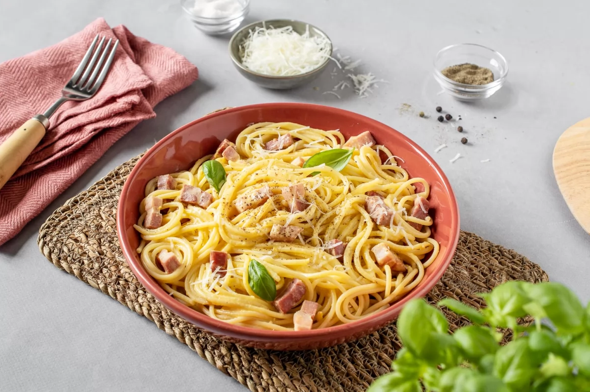
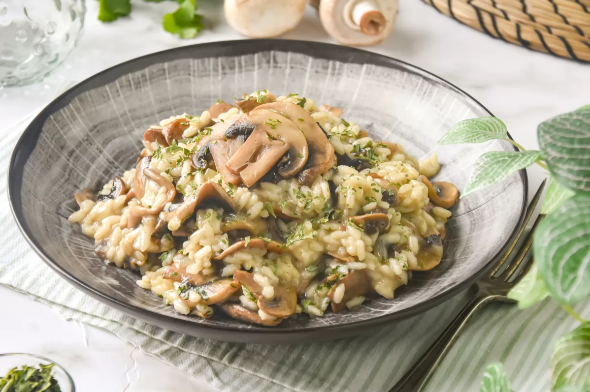

## Recetas italianas
Aqui exploraremos algunas recetas de origen italiano

* Focaccia
  La focaccia, una de las recetas estrella de la gastronomía italiana, es muy fácil de hacer. Te enseñamos a preparar en casa esta maravillosa receta originaria de Italia, un pan plano de miga esponjosa y alveolada que podrás cubrir con tus ingredientes favoritos.
  

* Espaguetis a la carbonara
  Aprende la receta de los auténticos espaguetis carbonara con guanciale, yema de huevo y sin nata. Uno de los platos de pasta más populares en todo el mundo, fácil y rápido de preparar en casa. Aprende a hacerlo como si fueras italiano de nacimiento.
  

* Risotto de champiñones
  Para hacer este risotto de setas hemos utilizado champiñones, la variedad más común en nuestros mercados. Esta es una receta fácil y deliciosa para familiarizarte con este cásico de la gastronomía italiana. Echa un vistazo al paso a paso y descubre los mejores trucos para lograr un risotto en su punto.
  